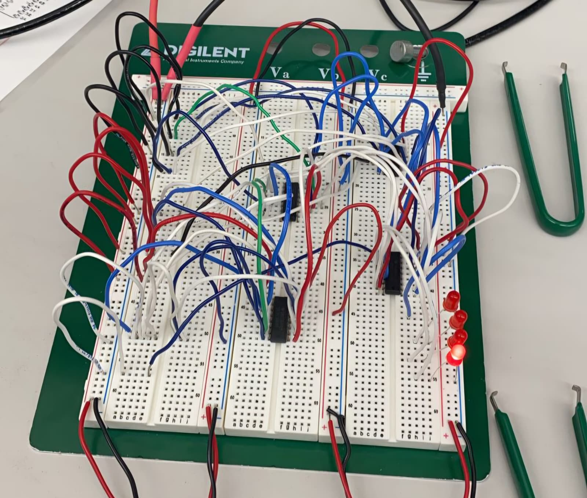
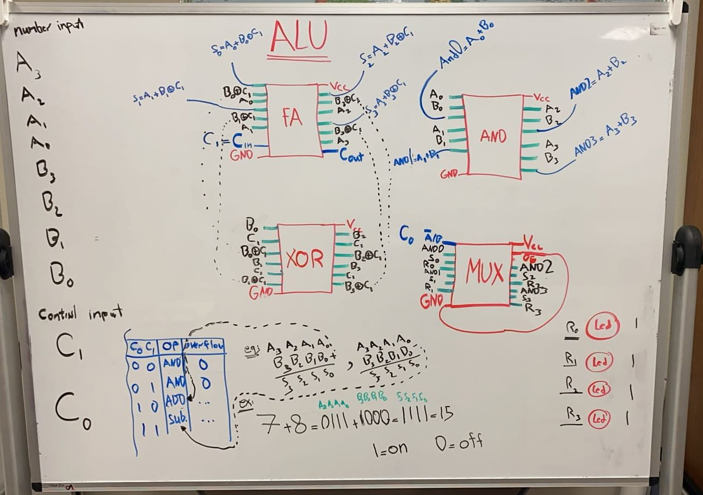

# 4-Bit ALU Breadboard Project

This project implements a physical 4-bit Arithmetic Logic Unit (ALU) built entirely on a breadboard using digital logic ICs. The ALU performs arithmetic and logical operations including addition, subtraction, and bitwise AND operations using full adders, XOR gates, AND gates, and multiplexers.

The project was developed for ECEN 248 at Texas A&M University and demonstrates both hardware circuit implementation and structural digital design concepts.

---

# Breadboard Implementation



The ALU was physically wired on a breadboard using integrated circuits and tested using LEDs to verify the outputs for multiple arithmetic and logic operations.

---

# ALU Design Diagram



The whiteboard diagram illustrates the internal ALU architecture including:
- Full adder block
- XOR subtraction logic
- AND operation block
- Multiplexer output selection
- Carry propagation
- Control signal operation

---

# Project Overview

The ALU accepts two 4-bit binary inputs:

- `A[3:0]`
- `B[3:0]`

and uses two control signals:

- `C1`
- `C0`

to determine the operation performed.

The final output is displayed using LEDs connected to the breadboard circuit.

---

# Supported Operations

| C1 | C0 | Operation |
|---|---|---|
| 0 | 0 | AND |
| 0 | 1 | AND |
| 1 | 0 | ADD |
| 1 | 1 | SUB |

---

# Hardware Components Used

The ALU was constructed using the following digital logic ICs:

- 74HC283E — 4-bit Full Adder
- 7486 — XOR Gates
- 7408 — AND Gates
- 74CT257N — 4-bit 2:1 Multiplexer
- LEDs for output visualization
- Breadboard and jumper wires
- Power supply connections

---

# Structural Hardware Modules

This repository includes explicit structural Verilog modules that match the physical breadboard implementation.

## Included Modules

- `full_adder.v`
- `ripple_carry_adder_4bit.v`
- `xor_subtractor_block.v`
- `and_block.v`
- `mux2to1_4bit.v`
- `alu_4bit_structural.v`
- `alu_4bit_structural_tb.v`

The design follows the same modular architecture used in the physical circuit implementation.

---

# Addition and Subtraction Logic

Subtraction is implemented using two’s complement arithmetic.

To compute:

```text
A - B
